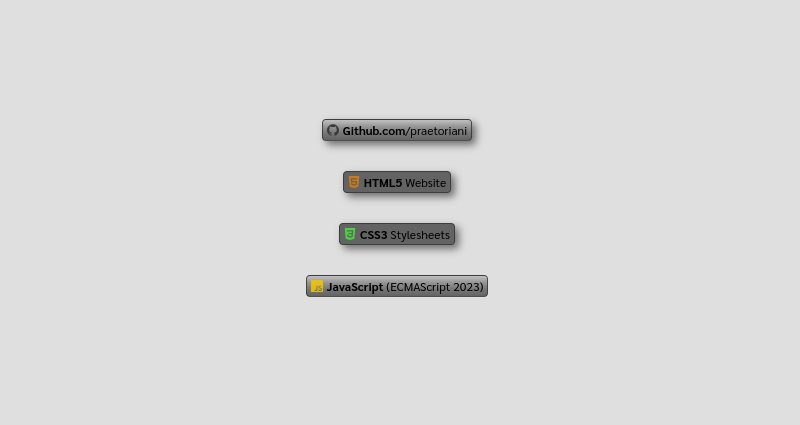

## Web Components (Samples): Badge Widget


For this example I thought of something special. Everyone knows those pretty, cute little shields/badges that display various information.<br><br>This is a very good example of the possibilities you have as a developer. You can either use a service from a person/company or do it yourself. In this case... you can use (for example) the service of [shields.io](https://shields.io/). But then you become dependent again.<br><br>Basically, we can create such shields/badges as web components. I'll show you what this can look like here, in this example<br><br>In the end we will have a component that looks something like this

```html
<badge-widget 
  icon="github"
  text="Github.com"
  info="/praetoriani"
  color="#303030"
  shadow="true"
  glossy="true">
</badge-widget>
```
<br>
Here is the explanation how it works
<br><br>

**icon**<br>
This property sets the icon of the batch.<br>
You can assign one of the following values:<br>'*github*' , '*html*' , '*css*' , '*jscript*'<br>


**text**<br>
With this property, you can write bold text on the badge

**info**<br>
With this property you can write normal text on the badge

**color**<br>
This property sets the color of the icon.<br>Only HEX-Values are allowed<br>(<code>#000000</code> for a black icon)

**shadow**<br>
This property defines, wether there is a shadow or not.<br>Accepts the following values:<br>'*true*' or '*false*'

**glossy**<br>
This property defines, if the badge has a 3d glow effect<br>Accepts the following values:<br>'*true*' or '*false*'

<br>

The *Badge Widget Example* has three files:
- <code>badge-widget.html</code><br>
  Demo Code that shows the component
- <code>badge-widget.css</code><br>
  Includes the whole CSS-Code for our component
- <code>badge-widget.js</code><br>
  Includes the whole Javascript-Code (including the SVGs)

<br>

> [!NOTE]
> THE SVGs are embedded in the js-file.
> You don't need the svg-files in the example folder

Here is a preview of the example:



Just look at the code, download the example and play around with it.
