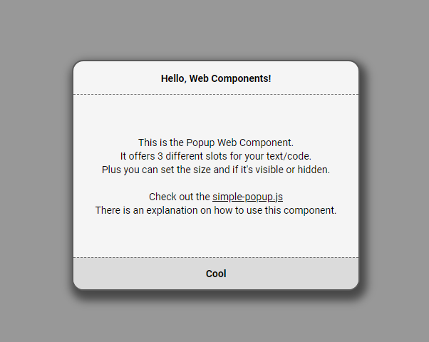

## Web Components (Samples): Simple Popup


This example is a bit more complex.<br>This time we will create a Popup Component with its own properties.<br><br>
In the end, we will have a component that looks something like the following code:
<br><br>

```html
  <simple-popup
     display="hide"
     size="320x200"
     title="Hello, World!"
     message="This is our Popup Component.<br>It can display multiple lines of text.<br>And the <i>Text</i> can be <code>styled</code> <u>as well</u>."
     button="Cool"
  ></simple-popup>
```
<br>
Here is the explanation how it works
<br>

**display**<br>
This property determins if the popup is visible or hidden.<br>
You can assign one of the following values: '*hide*' or '*show*'<br>
(This defines the initial state of our popup)


**size**<br>
This porperty sets the '*width*' and the '*height*' of our popup window<br>
(Keep in mind that these values are in '*px*')

**title**<br>
Here you can set the title of the popup.

**message**<br>
Here you can set message text of the popup.<br>
You can also use HTML-Code to style/format your text.

**button**<br>
This is the text that will be shown on the button

<br>

The *Simple Popup Example* has three files:
- <code>simple-popup.html</code><br>
  Demo Code that shows the component
- <code>simple-popup.css</code><br>
  Includes the whole CSS-Code for our component
- <code>simple-popup.js</code><br>
  Includes the whole Javascript-Code

<br>

Here is a preview of the example:



Just look at the code, download the example and play around with it.
