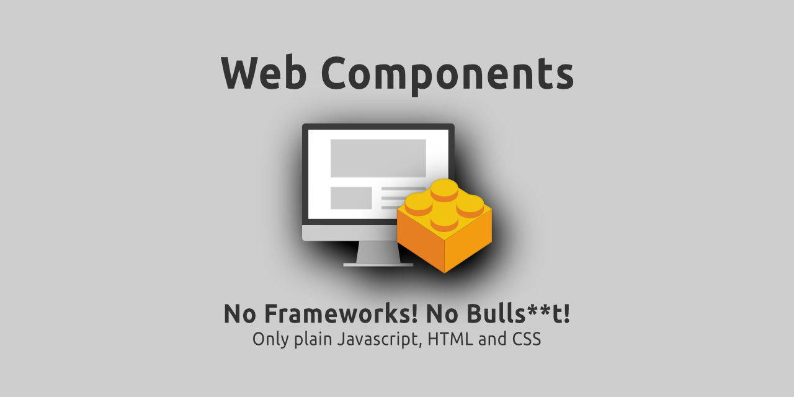
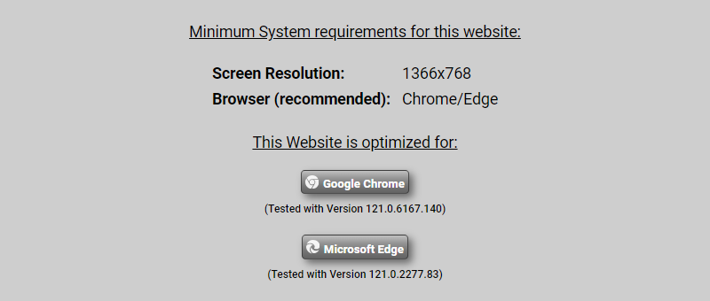
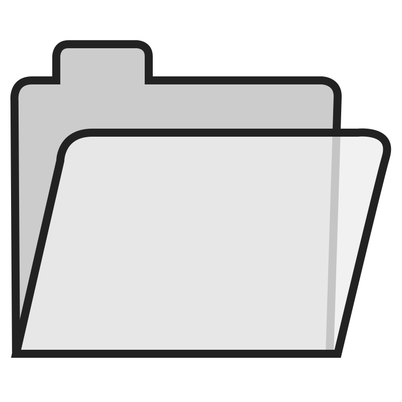

## Welcome to my Web Component Repo

I'm pleased that you found your way here to this repository. I've been working a lot on this private project lately and made some changes to this repository as well.
  
This repository now has its own website (here on Github). I created this website to provide information about web components as well as to show examples of what is possible with web components. There is also a tutorial in which I explain how to create a simple web component.
   

## News/Updates

Latest Update: 15.02.2024 
In the last few days I have revised the tooltip popup and published a new version. Information about this can be found in the release information. There is also another new web component. The modal window. This is a further development of the Simple Popup. The modal window offers more setting options and can be configured in almost all ways.
   

## Informations about the website:**

  
I optimized my website for Google Chome and Microsoft Edge (these browsers have the largest market share). 
I tested the website with the following browsers:
  
<strong>Chrome</strong> (Version 121.0.6167.140 )  
<strong>Edge</strong> (Version 121.0.2277.98)  
<strong>Opera One</strong> (Version 106.0.4998.70)  
<strong>Firefox</strong> (Version 122.0)  
 
The website works perfectly on all chromium-based browsers (with Blink Browser Engine). 
This applies to the following browsers: 
<strong>Chrome</strong> , <strong>Edge</strong> , <strong>Opera</strong> , <strong>Vivaldi</strong> , <strong>Brave</strong> , <strong>Bomite</strong>
  
<strong>Please note</strong>
 
Currently the website is not optimized for mobile devices. The website can be viewed on mobile devices, but it might be that you'll notice some issues with the layout of the website. 
At the moment the website does not yet fully support Firefox. You might recognize some small design issues.
  
You can find the website here: 
https://praetoriani.github.io/web-components/
 
I don't want to say too much in advance... but the website starts with an intro animation.  If you would prefer to go directly to the homepage of the website, simply use the following link: 
https://praetoriani.github.io/web-components/landingpage.html
  

## A guide to this repo

Let me give you a short guide on how this repo is structured and how I organzied everything:

 **assets** 
Here are just various images that I use in the readme pages.
  
 **development** 
This folder contains all the web components that I have designed so far. So for each web component there is a separate subfolder with the complete source code (including application example). Each web component comes with its own readme (I recommend reading this one). All web components in this folder are not officially released and should therefore only be used for testing and development processes.
  
 **docs** 
This directory is exclusively for the repository website. All important and relevant data for the website is stored here.
  
 **releases** 
Here you can find the officially released web components. There is a <code>README.MD</code> inside the <b>releases</b> folder ,which contains informations about the current (latest) releases. Each web component has its own subfolder inside the <b>releases</b> folder, which contain all published versions of the web components (as a ZIP archive). The structure will look like this:
  
 releases 
&nbsp;&nbsp;&nbsp;&nbsp;&nbsp; demo-component 
&nbsp;&nbsp;&nbsp;&nbsp;&nbsp;&nbsp;&nbsp;&nbsp;&nbsp;&nbsp;&nbsp;demo-component-v1.00.01.zip 
&nbsp;&nbsp;&nbsp;&nbsp;&nbsp;&nbsp;&nbsp;&nbsp;&nbsp;&nbsp;&nbsp;demo-component-v1.00.02.zip 
&nbsp;&nbsp;&nbsp;&nbsp;&nbsp; sample-component 
&nbsp;&nbsp;&nbsp;&nbsp;&nbsp;&nbsp;&nbsp;&nbsp;&nbsp;&nbsp;&nbsp;sample-component-v1.00.01.zip 
 

## Important information about the releases
First of all: This whole repo is a private project in which I have invested a lot of time (especially recently). I developed every single web component in my free time and make them available here (under the MIT license).
  
When developing the web components, I did my best to offer the most flexible and error-free solution possible. But unfortunately I cannot guarantee that all of my code will work without errors on all browsers and under all circumstances. Therefore, I try to cover the largest market share. And this is on chromium-based browsers.
  
My web components consist of HTML, CSS and Javascript. The code is optimized for all chromium-based browsers that use the Blink Browser Engine. This applies to the current versions of the following browsers: 
<strong>Chrome</strong> , <strong>Edge</strong> , <strong>Opera</strong> , <strong>Vivaldi</strong> , <strong>Brave</strong> , <strong>Bomite</strong>
  
Before I deploy and publish my components, I test them at least with Google Chrome and Microsoft Edge. Unfortunately, due to lack of time, I haven't gotten around to supporting other browsers (browser engines) yet. But I'm working on ensuring that every web component runs on as many browsers as possible. The plan is to create an overview showing which web component supports which browser. There is no complete overview yet, but you can find some informations about compatibility in the <code>README.md</code> in the release folder.
  
If you want to use my web components, you should remember that I have only developed, tested and released them for chromium-based browser engines.
  
You can find more informations about the releases and their compatibility in the <code>README.md</code> in the releases folder
  

## Why isn't Apple/Safari mentioned?
I work with Windows. Apple stopped supporting Safari on Windows back in 2012. The latest version available is Safari 5.1.7. So pretty outdated. Unfortunately, I haven't yet found a satisfying solution to test the website/components for compatibility with Apple/Safari (and the Webkit browser engine). So all I can currently say is that the website/components probably almost certainly work with Safari. But I cannot guarantee that everything will behave as it should.
  
There is also a requirement from Apple that all browsers under iOS must also use the Webkit browser engine. This means that both, my website and the web components I developed may produce completely different results under iOS with Chrome/Edge/Firefox than it would be the case under Windows.
