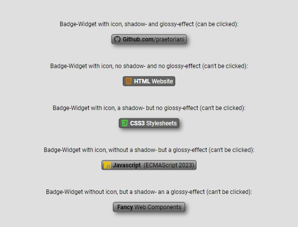

# Badge Widget Information

## Preview
<p align="left">

</p>
<br>

## Details

|  |  |
|:-|-:|
|Web Component ID: &nbsp;&nbsp;&nbsp; | &nbsp;&nbsp;&nbsp; Badge Widget|
|Last Update: &nbsp;&nbsp;&nbsp; | &nbsp;&nbsp;&nbsp; 02.02.2024|
|Current Version: &nbsp;&nbsp;&nbsp; | &nbsp;&nbsp;&nbsp; v1.00.16|
|Current Status: &nbsp;&nbsp;&nbsp; | &nbsp;&nbsp;&nbsp; stable|
|Released Version: &nbsp;&nbsp;&nbsp; |  &nbsp;&nbsp;&nbsp; v1.00.16|

<br>

| Browser Name &nbsp;&nbsp;&nbsp; | &nbsp;&nbsp;&nbsp; Version used for testing &nbsp;&nbsp;&nbsp; | &nbsp;&nbsp;&nbsp; Compatibility Check |
|:--|:-:|--:|
| Chrome | 121.0.6167.140 |  |
| Edge | 121.0.2277.98 |  |
| Opera One | 106.0.4998.70 |  |
| Firefox | 122.0 |  |
| Safari | &nbsp; |  |

<br>

## Known Bugs/Issues
<br>
<strong>General information:</strong><br>
The Badge Widget uses various CSS properties for the design. Rounded edges, shadows and glossy effects are used here. These styles are interpreted differently (depending on the browser). In some browsers it can happen that the edges/borders look slightly pixelated in connection with the shadow effect. This behavior is not an error caused by the component, but is a behavior of the browser that I cannot influence.

<br><br>
<strong>Release note for Firefox:</strong><br>
For some reason I don't understand, there seems to be some problems with spaces " " when the component renders the text/code from the slots. There is a simple solution here: Instead of spaces (i.e. " ") simply use the corresponding HTML entity (i.e. <code>\&nbsp;</code>). Here's an example: You want the text “<code>web components are cool</code>” to appear on the badge widget in the “badgetext” slot. Then you have to format the text for Firefox as follows: "<code>web\&nbsp;components\&nbsp;are\&nbsp;cool</code>". Each white space must be replaced by <code>\&nbsp;</code>. I'm going to fix this issue in the next release.

<br>

## Badge Widget Usage Instructions

<strong>Prerequisites:</strong><br>
To use this web component, you have to make sure, that the javascript file <code>badge-widget.js</code> and the css file <code>badge-widget.css</code> are both in the same directory. Then you have to add the Javascript fie to the header of you html file

```html
<!DOCTYPE html>
<html>
<head>
    <meta charset="UTF-8">
    <meta name="viewport" content="width=device-width, initial-scale=1.0">
    <title>Badge Widget</title>
    <!-- ADD THIS LINE TO YOUR HEADER -->
    <script src="badge-widget.js"></script>
</head>
<body>

</body>
</html>
```

After adding the Javascript you can use the web component by adding following code to the html file:

```html
<badge-widget
   iconname="github"
   iconcolor="#303030"
   shadow="true"
   glossy="true"
   linkurl="https://github.com/praetoriani"
>
    <span slot="badgename" class="YOUR-CSS-CLASS">
        <strong>Github.com</strong>
    </span>
    <span slot="badgetext" class="YOUR-CSS-CLASS">
        /praetoriani
    </span>
</badge-widget>
```
<br>

### Explanation/Instruction of the attributes:
<br>
<code>iconname</code>&nbsp;&nbsp;&nbsp;(required)
<br>
Currently only accepts one of the following values:
<br>
<b>github</b> , <b>html</b> , <b>css</b> , <b>jscript</b> , <b>chrome</b> , <b>edge</b>
<br><br>
If you do not want to use an icon you simply pass an empty value to the attribute (<code>iconname=""</code>)
<br><br><br>
<code>iconcolor</code>&nbsp;&nbsp;&nbsp;(required)
<br>
Only accepts HEX-Values (like <code>#303030</code>). This attribute sets the color of the icon.

If you do not want to use an icon you simply pass an empty value to the attribute (<code>iconcolor=""</code>)
<br><br><br>
<code>shadow</code>&nbsp;&nbsp;&nbsp;(required)
<br>
With this attribute you can choose whether you want a shadow on the badge or not. It only accepts <code>true</code> or <code>false</code> as value.
<br><br><br>
<code>glossy</code>&nbsp;&nbsp;&nbsp;(required)
<br>
Here you can choose whether to display a glossy effect on the badge or not. It only accepts <code>true</code> or <code>false</code> as value.
<br><br><br>
<code>linkurl</code>&nbsp;&nbsp;&nbsp;(optional)
<br>
With this attribute you can add a click-event to the badge. If the badge is clicked, it will open the given url in a new tab. So you should assign a proper url to this attribute (currently the script doesn't check the url)
<br><br>

### Explanation/Instruction of the slots:
<br>
The Badge Widget has two named slots (<code>badgename</code> and <code>badgetext</code>). To implement those slots into the Badge Widget, you have to add <code>&lt;span&gt;</code> tags to the component (look at the code at the top). Both slots have to be added to the component. Otherwise the component can't be built correctly by the javascript and therefore it will not work without these slots.
<br><br>
The <code>badgename</code> slot defines the left text area of the Badge Widget. The <code>badgetext</code> slot defines the right text area of the Badge Widget. You can use your own font styles by simply adding the <code>class='...'</code> attribute to the  <code>&lt;span&gt;</code> tags. The text you want to display on the badge goes between the  <code>&lt;span&gt;</code> tags. 
<br><br><br>

**Please read the following information, if you want to use your own css class:**
<br>
The Javascript (which builds the component) only allows changes to the following css properties:<br>
<i>font-family</i> , <i>font-weight</i> , <i>font-style</i> , <i>font-size</i> , <i>color</i><br>
All other css properties will be ignored.
<br><br>

## Important note about using the component
<code>

YOU ARE USING THESE FILES/SCRIPTS AT YOUR OWN RISK.
YOU DECIDE FOR YOURSELF WHERE AND HOW YOU WANT TO
USE THIS COMPONENT. YOU ARE RESPONSIBLE FOR ANY
CONSEQUENCES THAT MAY RESULT FROM THE USE OF THIS
WEB COMPONENT.

I AM NOT RESPONSIBLE OR LIABLE FOR ANY PROBLEMS,
MALFUNCTIONS, ERRORS OR OTHER DISASTERS THAT MAY
BE CAUSED BY USING THESE FILES IN YOUR PROJECTS.

THESE FILES WERE PUBLICATED UNDER THE MIT LICENSE

</code>