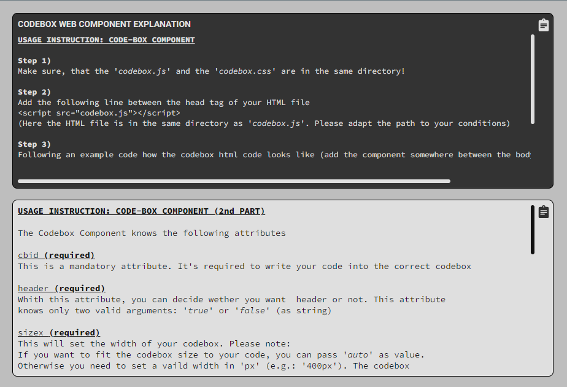

# Codebox Information

## Preview
<p align="left">

</p>
<br>
<a href="https://praetoriani.github.io/web-components/release-demo/codebox/demoone.html">Live Demo No.1</a><br>
<a href="https://praetoriani.github.io/web-components/release-demo/codebox/demotwo.html">Live Demo No.2</a><br>
<br>

## Details

|  |  |
|:-|-:|
|Web Component ID: &nbsp;&nbsp;&nbsp; | &nbsp;&nbsp;&nbsp; Codebox|
|Last Update: &nbsp;&nbsp;&nbsp; | &nbsp;&nbsp;&nbsp; 11.02.2024|
|Current Version: &nbsp;&nbsp;&nbsp; | &nbsp;&nbsp;&nbsp; v1.00.25|
|Current Status: &nbsp;&nbsp;&nbsp; | &nbsp;&nbsp;&nbsp; stable|
|Released Version: &nbsp;&nbsp;&nbsp; |  &nbsp;&nbsp;&nbsp; v1.00.25|

<br>

| Browser Name &nbsp;&nbsp;&nbsp; | &nbsp;&nbsp;&nbsp; Version used for testing &nbsp;&nbsp;&nbsp; | &nbsp;&nbsp;&nbsp; Compatibility Check |
|:--|:-:|--:|
| Chrome | 121.0.6167.140 |  |
| Edge | 121.0.2277.98 |  |
| Opera One | 106.0.4998.70 |  |
| Firefox | 122.0 |  |
| Safari | &nbsp; |  |

<br>

## Known Bugs/Issues
<br>
<strong>General information:</strong><br>
The Codebox component uses special CSS styles to customize the appearance and behavior of the scroll bars. Depending on the browser, these styles might be interpreted differently. This is not an error, but rather a behavior of the browser.

<br>

## What's new?
<br>
<strong><u>Changelog v1.00.25:</u></strong><br>
<ul>
<li>Optimized Error-Handling. The Codebox Component will only be created, if all requirements are fullfilled! Otherwise the Web Component will throw an error inside the debugging console</li>
<li>Implemented global Properties/Objects</li>
<li>Additional <code>ShadowDOM</code> Class added (has some specific functions to handle the Shadow DOM)</li>
</ul>

<br>

## Codebox Usage Instructions

<strong>Prerequisites:</strong><br>
The Codebox Component consists of two files: <code>codebox.js</code> and <code>codebox.css</code><br>
These both files must be in the same directory. <b>Never</b> separate these two files!

```html
<!DOCTYPE html>
<html>
<head>
    <meta charset="UTF-8">
    <meta name="viewport" content="width=device-width, initial-scale=1.0">
    <title>Codebox Web Component</title>
    <!-- ADD THIS LINE TO YOUR HEADER -->
    <script src="codebox.js"></script>
</head>
<body>

</body>
</html>
```
In this example, I assume that the html file is in the same directory with <code>codebox.js</code> and <code>codebox.css</code>. Please adapt the path to the <code>codebox.js</code> according to your needs. After adding the Javascript to the header of your HTML file, you can use the web component by adding following code to the html file:

```html
<codebox cbid="CodeBoxID" header="true" sizex="600px" sizey="320px" design="black" codefont="gfsourcecode400" codesize="14px">
    <span slot="codeboxhead" class="YOUR-CSS-CLASS">
        CODEBOX-DEMO.HTML
    </span>
    <!-- MUST BE EMPTY -->
    <span slot="codeboxbody"></span>
</codebox>
```
<br>

### Explanation/Instruction of the attributes:
<br>
The Codebox Component knows the following attributes:<br><br>

<code>cbid</code> <b>(required)</b><br>
This is a mandatory attribute. It's required to write your code into the correct codebox

<code>header</code> <b>(required)</b><br>
Whith this attribute, you can decide wether you want  header or not. This attribute knows only two valid arguments: '<i>true</i>' or '<i>false</i>' (as string). The Codebox Component will use 'true' as default if you pass an invalid value.

<code>sizex</code> <b>(required)</b><br>
This will set the width of your codebox. Please note:
If you want to fit the codebox size to your code, you can pass '<i>auto</i>' as value. Otherwise you need to set a vaild width in 'px' (e.g.: '400px'). The codebox automatically will display scrollbars, if your code is over-width. The Codebox Component will use 'auto' as default if you pass an invalid value.

<code>sizey</code> <b>(required)</b><br>
This will set the heigth of your codebox. Please note:
If you want to fit the codebox size to your code, you can pass '<i>auto</i>' as value. Otherwise you need to set a vaild width in 'px' (e.g.: '400px'). The codebox autoativally will display scrollbars, if your code is too long The Codebox Component will use 'auto' as default if you pass an invalid value.

<code>design</code> <b>(required)</b><br>
This attribute gives you the option to select between a dark or bright design.<br>
You can do this by passing either '<i>black</i>' or '<i>white</i>' as a value to the attribute.

<code>codefont</code> <b>(required)</b><br>
The Codebox Component uses the following Google Fonts:<br>
<i>Roboto Mono</i>, <i>Noto Sans Mono</i>, <i>Source Code Pro</i>, <i>JetBrains Mono</i>

You can use these fonts for your code by using the Font Name + Weight.<br>
These are the currently available font names (all fonds are available in 300, 400 and 600)
- gfRobotoMono
- gfNotoMono
- gfSourceCode
- gfJetBrains

Here is an example for JetBrains Mono 400:<br>
<code>codefont="gfjetbrains400"</code><br>
Another example for Roboto Mono 300<br>
<code>codefont="gfrobotomono300"</code><br>
And a last one for Noto Mono 600<br>
<code>codefont="gfnotomono600"</code><br>

<code>codesize</code> <b>(required)</b><br>
With this attribute you can assign a text size to the codebox. You have to declare it like <code>14px</code> or <code>12px</code>. If you forget the "px", the script will set a default size of 14px.
<br><br>

### Explanation/Instruction of the slots:
<br>
The Codebox has two named slots (<code>codeboxhead</code> and <code>codeboxbody</code>). To implement those slots into the Codebox Component, you have to add <code>&lt;span&gt;</code> tags to the component. Both slots have to be added to the component. Otherwise the component can't be built correctly by the javascript and therefore it will not work without these slots.
<br><br>
This is the <code>codeboxhead</code> slot.

```html
    <span slot="codeboxhead" class="YOUR-CSS-CLASS">
        Demo Source Code
    </span>
```
The <code>codeboxhead</code> slot can be used to set a title (or a short info about the code.) for the Codebox. You cann add your own font style by adding a <code>class</code> attribute to the span tag (like in the code above). The Codebox Component will only accept following CSS Properties:<br>
<i>font-family</i> , <i>font-weight</i> , <i>font-style</i> , <i>font-size</i> , <i>color</i> , <i>text-align</i> , <i>vertical-align</i>
<br><br>
This is the <code>codeboxbody</code> slot.

```html
    <span slot="codeboxbody"></span>
```
The <code>codeboxbody</code> slot only needs to be present. You cannot pass text/code to the component by using that slot. There is a special way to 'write' the text/code into the Codebox Component.
<br><br>

### How to write text/code to the Codebox Component:
<br>

There is a special way to write the text/code into the Codebox. Let me explain why and how. First of all ... the reason why I do not use the slot for that is, that the Codebox Component needs more control about formatting the code and how it will be displayed inside the Codebox Component. I tried several solutions which included the usage of the slot. But I did not get the results I wanted. And that's why I decided to create kind of a "workaround" for that scenario. Let me show you, how I do this with the Codebox Component:<br>

```html
<script>
var DemoSourceCode = `// simple javascript function
function CodemoxMessage() {
    console.log("Damn cool Codebox Component");
}`;
document.querySelector('code-box').CreateCodeSnippet("MyCodebox",DemoSourceCode)
</script>
```

In the example above, I declared a variable <code>DemoSourceCode</code> that stores the whole source code which I want to write into the instance of my Codebox Component. After that, the example calls the <code>CreateCodeSnippet(CodeboxID,SourceCode)</code> function from the Javascript Class <code>CodeboxComponent</code>. The code <code>document.querySelector('code-box').CreateCodeSnippet(CBID,CODE)</code> is always the same. You just change the params you pass to the function. The first param is the value of the <code>cbid</code> attribute. The second param is the source code.
<br>

<b>One more thing:</b><br>
There is an option to format the code inside the codebox. You can use bold , underlined or italic to format your text/code. Here is how to to it. Following Markup-Code is available<br>
<code>&#91;B+&#93;  ... your BOLD text ...  &#91;B-&#93;</code><br>
<code>&#91;U+&#93;  ... your UNDERLINED text ...  &#91;U-&#93;</code><br>
<code>&#91;I+&#93;  ... your ITALIC text ...  &#91;I-&#93;</code><br>

If you want to list items, you can put a &bull; in front of the line by using following Markup-Code:<br>
<code>&#91;BLI&#93;First Item</code><br>
<code>&#91;BLI&#93;Secont Item</code><br>
<code>&#91;BLI&#93;Third Item</code><br>

This will give you the following result:<br>
&bull; First Item<br>
&bull; Second Item<br>
&bull; Third Item<br>

Please note that there is no space between the &#93; and your Text.
This will be handled by the component itself ;)

<b>But keep in mind:</b><br>If you click on the clipboard icon in the upper right corner,
these special markup-codes will be removed!! The result will be plain text/code
without any bold, italic or underline (only the bullets will remain so that it's still a list).
<br><br>

## How to interact with the Codebox Web Component?
<br>
Working with web components is different than working with HTML objects in your own document. Every time you create a tooltip, an instance of that component is rendered in an isolated Shadow DOM. However, you won't be able to get this tooltip with a normal <code>document.getElementById()</code> because the instance of the component is not directly part of the html document itself. But the Shadow DOM (in which the component was rendered in) is kind of a child element of the original document root. As you can already see it's kind of a complex theme.
<br><br>
But I got a solution for that. The <b>Codebox Web Component</b> comes with an additional <code>ShadowDOM</code> Class that has some special functions. With these functions you have the ability to interact with your component. At the moment, the <code>ShadowDOM</code> Class knows the following functions :<br><br>

```javascript
ShadowDOM.GetComponent(DOMinstance,ObjectID);
ShadowDOM.ChangeVisibility(DOMinstance,ObjectID,ViewMode);
```
<b>At this point perhaps a few more words about the <code>ShadowDOM</code> Class</b><br>
The <code>ShadowDOM</code> Class is not for a specific web component, but rather is universal and can therefore be used with any web component. With this class I try to provide appropriate functions that enable interaction with my web components.<br><br>
<b>How to use these functions?</b><br>
The <code>ShadowDOM.GetComponent(DOMinstance,ObjectID);</code> has two params. For the <b>Codebox Web Component</b> the <i>DOMinstance</i> is ALWAYS <code>code-box</code>. The <i>ObjectID</i> refers to the <code>cbid</code> you assigned to the <b>Codebox Web Component</b>. Here is a brief example:

```javascript
let [ ObjectExists,ObjectRef ] = ShadowDOM.GetComponent('code-box','MyOwnCodebox');
if( ObjectExists === true ) {
    ObjectRef.style.visibility = "hidden";
}
```
The <code>ShadowDOM.GetComponent(DOMinstance,ObjectID)</code> has two return values. The first return value is either <i>true</i> or <i>false</i> (depending on whether the element could be found or not). The second return is <code>null</code> if the first return value is <code>false</code>. But if the first return value is <code>true</code>, the second return value will point to the instance of your <b>Codebox Web Component</b>. And with this you can directly manipulate the Component by yourself. You could add an event listener (for example):

```javascript
let [ ObjectExists,ObjectRef ] = ShadowDOM.GetComponent('code-box','MyOwnCodebox');
if( ObjectExists === true ) {
    ObjectRef.addEventListener('click', function() {
        console.log("MyOwnCodebox was cicked :)");
    })
}
```
As you can see, the <code>ShadowDOM.GetComponent(DOMinstance,ObjectID)</code> is a powerful function that offers you a lot of possibilities. For those of us who aren't very familiar with Javascript (or who just want a quick function to show or hide the web component), there is another function:

```javascript
ShadowDOM.ChangeVisibility(DOMinstance,ObjectID,ViewMode);
```
The <code>ShadowDOM.ChangeVisibility(DOMinstance,ObjectID,ViewMode)</code> needs the following three params: <i>DOMinstance</i> is ALWAYS <code>code-box</code>. The <i>ObjectID</i> refers to the <code>cbid</code> you assigned to the <b>Codebox Web Component</b> and the <i>ViewMode</i> can either be <code>visible</code> or <code>hidden</code>. Here is a brief example:

```javascript
// This will show the 'MyOwnCodebox'
ShadowDOM.ChangeVisibility('code-box','MyOwnCodebox','visible');

// This will hide the 'DemoCodebox'
ShadowDOM.ChangeVisibility('code-box','DemoCodebox','hidden');
```
<br><br>
As I mentioned, the <code>ShadowDOM</code> Class doesn't have a lot of features at the moment.<br>But I'm working on implementing even more functions here to make interactions with my web components easier.
<br><br><br><br>

## Important note about using the component

YOU ARE USING THESE FILES/SCRIPTS AT YOUR OWN RISK.<br>
YOU DECIDE FOR YOURSELF WHERE AND HOW YOU WANT TO<br>
USE THIS COMPONENT. YOU ARE RESPONSIBLE FOR ANY<br>
CONSEQUENCES THAT MAY RESULT FROM THE USE OF THIS<br>
WEB COMPONENT.<br>
<br>
I AM NOT RESPONSIBLE OR LIABLE FOR ANY PROBLEMS,<br>
MALFUNCTIONS, ERRORS OR OTHER DISASTERS THAT MAY<br>
BE CAUSED BY USING THESE FILES IN YOUR PROJECTS.<br>
<br>
THESE FILES WERE PUBLICATED UNDER THE MIT LICENSE<br>