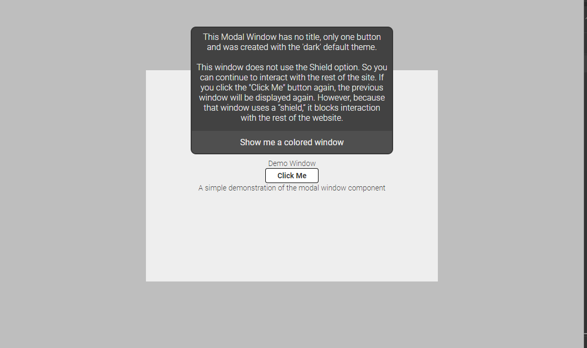
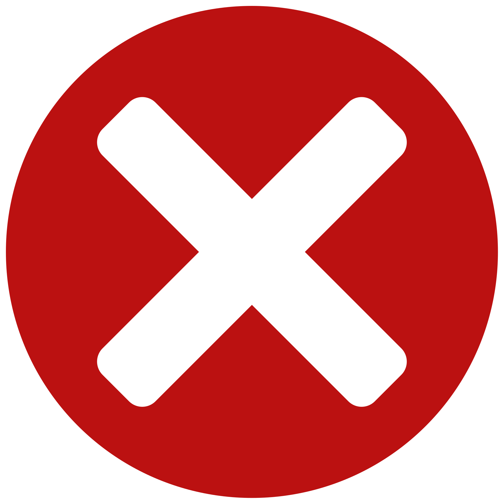

# Modal Window Information

## Preview
<p align="left">

</p>
<br>
<a href="https://praetoriani.github.io/web-components/release-demo/modal-win/demoone.html">Live Demo No.1</a><br>
<a href="https://praetoriani.github.io/web-components/release-demo/modal-win/demotwo.html">Live Demo No.2</a><br>
<br>

## Details
|  |  |
|:-|-:|
|Web Component ID: &nbsp;&nbsp;&nbsp; | &nbsp;&nbsp;&nbsp; Modal Window|
|Current Version: &nbsp;&nbsp;&nbsp; | &nbsp;&nbsp;&nbsp; v1.01.06|
|Current Status: &nbsp;&nbsp;&nbsp; | &nbsp;&nbsp;&nbsp; stable|
|Released Version: &nbsp;&nbsp;&nbsp; |  &nbsp;&nbsp;&nbsp; v1.01.06|

<br>

| Browser Name &nbsp;&nbsp;&nbsp; | &nbsp;&nbsp;&nbsp; Tested Version &nbsp;&nbsp;&nbsp; | &nbsp;&nbsp;&nbsp; Compatibility Check |
|:--|:-:|--:|
| Chrome | 121.0.6167.161 |  |
| Edge | 121.0.2277.112  |  |
| Opera One | 106.0.4998.70 |  |
| Firefox | 122.0.1  |  |
| Safari | &nbsp; |  |

<br>

## Known Bugs/Issues
<br>

<strong>General release notes:</strong><br>
There were no known bugs at the time of publication

<br>

## What's new?
<br>
<strong><u>Changelog v1.01.06 (initial release):</u></strong><br>
<ul>
<li>Compared to the other web components, this component uses a completely redesigned structure.</li>
<li>The CSS has been re-designed to be so flexible that almost everything can be customized</li>
<li>You can create your own design themes for the modal window</li>
<li>The implemented ShadowDOM class has been revised for the modal window</li>
</ul>

<br>

## Modal Window Usage Instructions

<strong>Prerequisites:</strong><br>
The <b>Modal Window Web Component</b> has two files: <code>modal-win.js</code> and <code>modal-win.css</code>. Both files must be in the same directory! Otherwise the Javascript will not be able to inject the CSS file. To use the <b>Modal Window Web Component</b> you simply need to add the Javascript file to the header part of your HTML file:

```html
<!DOCTYPE html>
<html>
<head>
    <meta charset="UTF-8">
    <title>Tooltip Popup</title>
    <!-- ADD THIS LINE TO YOUR HEADER -->
    <script src="modal-window.js"></script>
</head>
<body>

</body>
</html>
```

In the above demo code I assume that the HTML file is in the same directory together with the <code>modal-win.js</code>. Please adapt the <code>src</code> to your needs. After adding the Javascript you can use the web component by adding following code to the html file:

```html
<modal-win mwid="DemoWindowWhite" winsize="520x300" pos="100:100" stacklvl="200" caption="true" btncount="2" shield="true:20" view="visible" design="white">
    <span slot="modalwin-caption-slot" class="YOUR CSS CLASSES">Modal Window Web Component</span>
    <span slot="modalwin-message-slot" class="YOUR CSS CLASSES">
        This is a simple demonstration of the Modal Window Web Component.<br>
    </span>
    <span slot="modalwin-button1-slot" class="YOUR CSS CLASSES">Button 1</span>
    <span slot="modalwin-button2-slot" class="YOUR CSS CLASSES">Button 2</span>
</modal-win>
```
<br>

### Explanation/Instruction of the attributes:
<br>
The modal window knows the following attributes:
<br><br>
<code>mwid</code>&nbsp;&nbsp;&nbsp;(required)
<br>
This attribute assigns an unique id to the instance of your component. The <code>mwid</code> must be a unique name for the component's instance and is important so that the instance of your components can be clearly identified. If this attribute is not set, the component cannot be created!
<br><br>
<code>winsize</code>&nbsp;&nbsp;&nbsp;(required)
<br>
The <code>winsize</code> attribute sets the <i>width</i> and the <i>height</i> of the component. It has to be set like <b>400x300</b> (where 400 is the <i>width</i> and 300 is the <i>height</i>). Please do not use any units (like <i>px</i> etc.). This attribute has to be set. Otherwise the component will not be created.
<br><br>
<code>pos</code>&nbsp;&nbsp;&nbsp;(required)
<br>
With this attribute you can set the <i>top</i> and <i>left</i> position of the window. The attribute has to be defined like coordinates. Here is an example: <code>pos="80:120"</code> (where 80 is the position from the left and 120 is the position from the top). The attribute <code>pos</code> knows a special value. You can center the window on the x and/or y axis by setting a&nbsp;&nbsp;&nbsp;<b>c</b>&nbsp;&nbsp;&nbsp;as value. An Example: <code>pos="c:c"</code>. This will center the window horizontally and vertically. Another example: <code>pos="c:100"</code>. This will center the window horizontally with a distance of 100 from the top. This attribute has to be set. Otherwise the component will not be created.
<br><br>
<code>stacklvl</code>&nbsp;&nbsp;&nbsp;(required)
<br>
With this attribute you can set the level on the z-axis for the component. There's not much to consider here, except for the following: The value must be between 1 and 9999. If you create multiple windows, you should consider defining a different Z-level for each window (at least that's my recommendation). This attribute has to be set. Otherwise the component will not be created.
<br><br>
<code>caption</code>&nbsp;&nbsp;&nbsp;(required)
<br>
This attribute determines whether the Modal Window is created with a title/caption or not. There are only two posible values: <i>visible</i> or <i>hidden</i>. This attribute has to be set. Otherwise the component will not be created.
<br><br>
<code>btncount</code>&nbsp;&nbsp;&nbsp;(required)
<br>
This attribute defines the count of the buttons you want to use. The <code>btncount</code> attribute can be either 1, 2 or 3. This attribute has to be set. Otherwise the component will not be created.
<br><br>
<code>shield</code>&nbsp;&nbsp;&nbsp;(optional)
<br>
This attribute is special. This defines whether the modal window uses a <i>shield</i>. This <i>shield</i> blocks interaction with the rest of the website (depending on the z-index used). If this attribute is used, it must be specified in the following format <i>true/false</i><b>:</b><i>opacity</i>. The value left of the colon can only be <i>true</i> (shield is used) or <i>false</i> (shield is not used). To the right of the colon there must be a value between 1 and 100. This value defines the opacity. Here is an example: <code>shield='true:20'</code>. Here the modal window uses a shield with an opacity of 20%. The attribute <i>shield</i> is optional and must not be specified. By default, <code>shield='true:50'</code> is used. If you do not want to use a shield, you simply set <code>shield='false:5'</code>. The value right of the colon will be ignored if the value left of the colon is <i>false</i>.
<br><br>
<code>view</code>&nbsp;&nbsp;&nbsp;(required)
<br>
This attribute defines the initial visibility status of the modal window. Basically, the modal window can only be <i>visible</i> or <i>hidden</i>. Therefore the attribute can only have one of the two values. I personally recommend creating the modal window with <code>view='hidden'</code> and only showing it when it is really needed. Unless you want the modal window to be visible right from the start.
<br><br>
<code>design</code>&nbsp;&nbsp;&nbsp;(optional/required)
<br>
With this attribute you can choose whether you want to create the modal window with the <i>white</i> or <i>black</i> default theme. The attribute can therefore only have one of these two values. If this attribute is not set, then the modal window will be created with the <i>white</i> default theme. There is also the option to create your own themes and assign them to the modal window. However, this will be explained a little further below. As long as you don't use your own CSS theme, you only need to specify the 'design' attribute with an appropriate value. But if you want to use your own design, you should not define the <i>design</i> attribute.
<br><br>
<u>Additional explanation:</u><br>
I tried to catch as many errors as possible to enable the component to be created. Where possible, I try to use standard values. But that is not always possible. Therefore, the component may not be able to be created under some circumstances. In this case, an error message is always generated, which is displayed in the debugging console.
<br><br>

### Explanation/Instruction of the slots:
<br>
The modal window has a total of 5 namend slots, which can be used to display text/code within the modal window. Depending on how you set up the modal window, you will need the appropriate slots. Let me explain you how it works. Following are the 5 slots you can use:<br><br>


```html
<span slot="modalwin-caption-slot"> SLOT FOR THE TITLE/CAPTION </span>
<span slot="modalwin-message-slot"> SLOT FOT THE MESSAGE TEXT </span>
<span slot="modalwin-button1-slot"> SLOT FOR THE 1ST BUTTON </span>
<span slot="modalwin-button2-slot"> SLOT FOR THE 2ND BUTTON </span>
<span slot="modalwin-button3-slot"> SLOT FOR THE 3RD BUTTON </span>
```
These slots are important to render your content inside the component. Therefore the names of the slots must be used exactly as in the example code above. The <code>modalwin-message-slot</code> is always needed. This is the slot which will display the message on your modal window. The Modal window needs at least one button. So you will need the <code>modalwin-button1-slot</code> as well. All other slots are otional, depending on the setup of your modal window. Let me give you some examples:

```html
<!-- THIS MODAL WINDOW HAS A CAPTION (caption="true") AND USES TWO BUTTONS (btncount="2") -->
<modal-win mwid="DemoWindowWhite" winsize="180x120" pos="c:c" stacklvl="100" caption="true" btncount="2" shield="true:20" view="hidden" design="white">
    <!-- DUE TO WE USED caption="true" WE HAVE TO INCLUDE THIS SLOT TO RENDER THE TITLE/CAPTION -->
    <span slot="modalwin-caption-slot"></span>
    <!-- THE MESSAGE SLOT IS ALWAYS NEEDED -->
    <span slot="modalwin-message-slot"></span>
    <!-- THESE SLOTS DEPEND ON THE btncount SETTINGS. IN THIS CASE WE NEED TWO SLOTS BECAUSE WE WANT TO USE 2 BUTTONS -->
    <span slot="modalwin-button1-slot"></span>
    <span slot="modalwin-button2-slot"></span>
</modal-win>

<!-- THIS MODAL WINDOW HAS NO CAPTION (caption="false") AND USES ONLY ONE BUTTON (btncount="1") -->
<modal-win mwid="DemoWindowWhite" winsize="180x120" pos="c:c" stacklvl="100" caption="true" btncount="2" shield="true:20" view="hidden" design="white">
    <!-- THIS TIME, THERE IS NO "modalwin-caption-slot", BECAUSE THE MODAL WINDOW HAS NO CAPTION -->
    <!-- THE MESSAGE SLOT IS ALWAYS NEEDED -->
    <span slot="modalwin-message-slot"></span>
    <!-- THIS TIME WE'RE ONLY USING ONE BUTTON -->
    <span slot="modalwin-button1-slot"></span>
</modal-win>

```
As the two examples above show, the slots depend on the respective configuration of the modal window. So only the slots that we have specified in our configuration are required. All other slots do not need to be mentioned or will be ignored if they are not provided for in the configuration. Maybe one more example:
```html

<!-- THIS MODAL WINDOW HAS NO CAPTION (caption="false") AND USES ONLY ONE BUTTON (btncount="1") -->
<modal-win mwid="DemoWindowWhite" winsize="180x120" pos="c:c" stacklvl="100" caption="false" btncount="1" shield="true:20" view="hidden" design="white">
    <!-- THE modalwin-caption-slot WILL BE IGNORED BECAUSE THE CONFIGURATION IS caption="false" -->
    <span slot="modalwin-caption-slot"></span>
    <!-- THE MESSAGE SLOT IS ALWAYS NEEDED -->
    <span slot="modalwin-message-slot"></span>
    <!-- HERE ARE TWO SLOTS FOR THE BUTTNS, BUT THE modalwin-button2-slot WILL BE IGNORED DUE TO btncount="1" -->
    <span slot="modalwin-button1-slot"></span>
    <span slot="modalwin-button2-slot"></span>
</modal-win>

```
I hope that these three examples have made it clear how the slots have to be used correctly in order to get the desired results.
<br><br>
I quickly forgot one thing. You can also assign your own CSS classes to the slots so you can customize the font, font color, etc. However, it is important to know that you can only change certain CSS properties. You can use the following CSS properties in the slots:
<br>
<i>font-family , font-weight , font-style , font-size , color , text-align , vertical-align , white-space</i>
```html
<style>
.MyHeaderFont {
    font-family: Verdana;
    font-weight: normal;
    font-size: 16px;
    font-color: #000000;
}
</style>

<!-- ... SOME OTHER CODE ... -->

<modal-win .... >
    <!-- LET'S ADD OUR OWN CLASS -->
    <span slot="modalwin-caption-slot" class="MyHeaderFont"></span>
</modal-win>
```

<br><br>

## How to interact with the Modal Window Web Component?
<br>
Working with web components is different than working with HTML objects in your own document. Every time you create a modal window, an instance of that component is rendered in an isolated Shadow DOM. However, you won't be able to get this modal window with a normal <code>document.getElementById()</code> because the instance of the component is not directly part of the html document itself. But the Shadow DOM (in which the component was rendered in) is kind of a child element of the original document root. As you can already see it's a complex theme.
<br><br>
But I got a solution for that. The <b>Modal Window Web Component</b> comes with an additional <code>ShadowDOM</code> Class that has some special functions. With these functions you have the ability to interact with your component. The <code>ShadowDOM</code> Class knows the following functions :<br><br>

```javascript
ShadowDOM.GetComponent(DOMinstance,ObjectID);
ShadowDOM.ShowModalWindow(ObjectID)
ShadowDOM.HideModalWindow(ObjectID)
ShadowDOM.PreloadMWdesign(MWobjID,MWbgcolor,MWborder,MWbuttonbar,MWbtnhover)
```
<br>
<b>How to use these functions?</b><br><br>

<code>ShadowDOM.GetComponent(DOMinstance,ObjectID)</code><br><br>
The <code>ShadowDOM.GetComponent(DOMinstance,ObjectID)</code> has two params. For the <b>Modal Window Web Component</b> the <i>DOMinstance</i> is ALWAYS <code>modal-win</code>. The <i>ObjectID</i> refers to the <code>mwid</code> you assigned to the <b>Modal Window Web Component</b>. Here is a brief example:

```javascript
let [ ObjectExists,ObjectRef ] = ShadowDOM.GetComponent('modal-win','DemoWindow');
if( ObjectExists === true ) {
    ObjectRef.style.visibility = "hidden";
}
```
The <code>ShadowDOM.GetComponent(DOMinstance,ObjectID)</code> has two return values. The first return value is either <i>true</i> or <i>false</i> (depending on whether the element could be found or not). The second return value is <code>null</code> if the first return value is <code>false</code>. But if the first return value is <code>true</code>, the second return value will point to the instance of your <b>Modal Window Web Component</b>. You will need this function to assign your functions to the buttons of your modal window. Here is an example:
```HTML
<!-- THIS IS OUR MODAL WINDOW-->
<modal-win mwid="DemoWindowBlack" winsize="380x240" pos="c:50" stacklvl="100" caption="false" btncount="1" shield="false:20" view="hidden" design="black">
    <span slot="modalwin-message-slot">
        This Modal Window has no title, only one button and was created with the 'dark' default theme.
    </span>
    <span slot="modalwin-button1-slot">Button 1</span>
</modal-win>
<!-- NOW WE WANT OUR OWN FUNCTION FOR THE BUTTON -->
<script>
let [BTN1lookup,BTN1object] = ShadowDOM.GetComponent("modal-win","DemoWindowBlack-button1");
if(BTN1object) {
    BTN1object.addEventListener('click', () => {
        ShadowDOM.HideModalWindow("DemoWindowBlack");
    });
}
</script>
```
Please note that the Javascript code for assigning a function to the button must always come after the HTML code of the modal window! The example above shows how we create a modal window with the ID <code>DemoWindowBlack</code>. The Javascript code assigns a function to the <code>modalwin-button1-slot</code>. Now you probably want to know how you know what the ID of the button is so that you can assign a function to it. That's easy. Every time you create a modal window you must also include an <code>mwid</code> so that the window can be uniquely identified. Each button within this window has the ID of your window PLUS -buttonX. So if your modal window has the ID <i>DemoWin</i>, then your first button will have the ID <i>DemoWin-button1</i> and your second button <i>DemoWin-button2</i>. Another example:

```HTML
<!-- THIS IS OUR MODAL WINDOW WITH TWO BUTTONS -->
<modal-win mwid="DemoWindow" winsize="380x240" pos="c:50" stacklvl="100" caption="false" btncount="2" shield="false:20" view="hidden" design="black">
    <span slot="modalwin-message-slot">
        This Modal Window has no title, only one button and was created with the 'dark' default theme.
    </span>
    <span slot="modalwin-button1-slot">Button 1</span>
    <span slot="modalwin-button1-slot">Button 2</span>
</modal-win>
<!-- NOW WE WANT OUR OWN FUNCTION FOR THE BUTTON -->
<script>
// THIS ASSIGNS A FUNCTION TO THE 1ST BUTTON
let [BTN1lookup,BTN1object] = ShadowDOM.GetComponent("modal-win","DemoWindow-button1");
if(BTN1object) {
    BTN1object.addEventListener('click', () => {
        ShadowDOM.HideModalWindow("DemoWindow");
    });
}
// THIS ASSIGNS A FUNCTION TO THE 2ND BUTTON
let [BTN2lookup,BTN2object] = ShadowDOM.GetComponent("modal-win","DemoWindow-button2");
if(BTN2object) {
    BTN2object.addEventListener('click', () => {
        ShadowDOM.HideModalWindow("DemoWindow");
    });
}
</script>
```
<br><br>
<code>ShadowDOM.ShowModalWindow(ObjectID)</code><br>
<code>ShadowDOM.HideModalWindow(ObjectID)</code><br>
<br>
These two functions are actually almost self-explanatory. The <code>ShadowDOM.ShowModalWindow(ObjectID)</code> function is used to show a modal window and the <code>ShadowDOM.HideModalWindow(ObjectID)</code> function is used to hide a modal window. Both functions only have one param. The <code>ObjectID</code> refers to the <code>mwid</code> you assigned to you modal window.
```HTML
<!-- THIS IS OUR MODAL WINDOW WITH ID 'DemoWindow' -->
<modal-win mwid="DemoWindow" winsize="380x240" pos="c:50" stacklvl="100" caption="false" btncount="2" shield="false:20" view="hidden" design="black">
    <span slot="modalwin-message-slot">
        This Modal Window has no title, only one button and was created with the 'dark' default theme.
    </span>
    <span slot="modalwin-button1-slot">Button 1</span>
    <span slot="modalwin-button1-slot">Button 2</span>
</modal-win>
<!-- NOW WE WANT OUR OWN FUNCTION FOR THE BUTTON -->
<script>
    // THIS WILL SHOW THE 'DemoWindow'
    ShadowDOM.ShowModalWindow("DemoWindow");
    // THIS WILL HIDE THE 'DemoWindow'
    ShadowDOM.HideModalWindow("DemoWindow");
</script>
```
<br><br>
<code>ShadowDOM.PreloadMWdesign(MWobjID,MWbgcolor,MWborder,MWbuttonbar,MWbtnhover)</code><br>
<br>
This function is a very special function. With the <code>PreloadMWdesign()</code> function you can create your own color themes for the modal window and thus use your own design. The function has a total of 5 parameters. The first parameter <i>MWobjID</i> is the <i>mwid</i> of your window to which you want to assign this color theme. The other 4 parameters (<i>MWbgcolor, MWborder, MWbuttonbar, MWbtnhover</i>) are there to define color values. These must be in a valid HEX format (e.g. #CCC or #303030). <i>MWbgcolor</i> defines the background color of the modal window. <i>MWborder</i> defines the color of the border of the modal window. <i>MWbuttonbar</i> defines the color of the bar for the buttons and <i>MWbtnhover</i> sets the color that the button gets when you hover over it.
<br><br>
<b>These things are important.<br>
1) The function must be called BEFORE you create your modal window.<br>
2) <i>MWobjID</i> must be the correct ID of the modal window!<br>
3) Do not use the 'design' attribute</b><br>

Here is an example:

```HTML
<script>
    // THIS LINE HAS TO BE CALLED RIGHT BEFORE THE HTML-CODE OF THE MODAL WINDOW
    ShadowDOM.PreloadMWdesign('UserDesignWindow','#007bce','#222222','#006cb4','#14669c');
</script>
<!-- THIS IS OUR MODAL WINDOW WITHOUT THE 'design' attribute -->
<modal-win mwid="UserDesignWindow" winsize="380x240" pos="c:50" stacklvl="100" caption="false" btncount="2" shield="false:20" view="hidden">
    <span slot="modalwin-message-slot">
        This Modal Window has no title, only one button and was created with the 'dark' default theme.
    </span>
    <span slot="modalwin-button1-slot">Button 1</span>
    <span slot="modalwin-button1-slot">Button 2</span>
</modal-win>
```
It is important to understand that you can either use a default theme (by using the <i>design</i> attribute with <i>white</i> or <i>black</i>) or you can set your own theme. If you set your own design and the <i>design</i> attribute is defined at the same time, the <i>design</i> attribute will be ignored and your design will be used. If an error occurs, for example because you did not pass a correct HEX value, the script will try to catch this error and then try to use <i>white</i> as the default design.
<br><br>

## FAQ
<br>
<b>The Modal Window doesn't appear on my page?</b><br>
There can be (at least) two reasons for this. First you should check how you created the component. Check the <i>view</i> attribute. If you used <i>hidden</i>> as value here, the tooltip popup will be created but not displayed visibly. The other reason may be that the component cannot be created at all (e.g. because attributes are missing or incorrect values were set for the attributes). Please check your HTML code again.
<br><br>
<b>Why does the text doesn't appear in the Modal Window?</b><br>
The text within the modal window is controlled via the slots. Depending on where you want to display text, you have to mention the corresponding slot in your HTML code. Please read the following section again:

[Explanation/Instruction of the slots](./README.md#explanationinstruction-of-the-slots)

<b>Why is my component not being build sometimes?</b><br>
In order for the web component to be created correctly, it is necessary that all mandatory information has been provided correctly. Therefore, the script checks at the beginning whether all necessary attributes have been specified and whether these attributes also contain the correct values. I try to catch as many errors as possible in my script by trying to use default values. But this is not always possible and not for all attributes. Therefore, it may sometimes happen that the script has to cancel the creation process. In this case, an error message is displayed in the console. This console can be opened on Chrome/Edge/Firefox/Opera with the keyboard shortcut CTRL+SHIFT+I. Here you can check whether and which error occurred.

<br><br>

... there's more coming soon ...

<br><br><br><br>

## Important note about using the component

YOU ARE USING THESE FILES/SCRIPTS AT YOUR OWN RISK.<br>
YOU DECIDE FOR YOURSELF WHERE AND HOW YOU WANT TO<br>
USE THIS COMPONENT. YOU ARE RESPONSIBLE FOR ANY<br>
CONSEQUENCES THAT MAY RESULT FROM THE USE OF THIS<br>
WEB COMPONENT.<br>
<br>
I AM NOT RESPONSIBLE OR LIABLE FOR ANY PROBLEMS,<br>
MALFUNCTIONS, ERRORS OR OTHER DISASTERS THAT MAY<br>
BE CAUSED BY USING THESE FILES IN YOUR PROJECTS.<br>
<br>
THESE FILES WERE PUBLICATED UNDER THE MIT LICENSE<br>