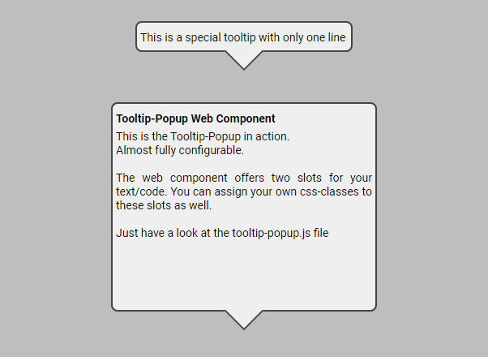

# Tooltip Popup Information

## Preview
<p align="left">

</p>
<br>
<a href="https://praetoriani.github.io/web-components/release-demo/tooltip-popup/demoone.html">Live Demo No.1</a><br>
<a href="https://praetoriani.github.io/web-components/release-demo/tooltip-popup/demotwo.html">Live Demo No.2</a><br>
<br>

## Details
|  |  |
|:-|-:|
|Web Component ID: &nbsp;&nbsp;&nbsp; | &nbsp;&nbsp;&nbsp; Tooltip Popup|
|Current Version: &nbsp;&nbsp;&nbsp; | &nbsp;&nbsp;&nbsp; v1.00.22|
|Current Status: &nbsp;&nbsp;&nbsp; | &nbsp;&nbsp;&nbsp; stable|
|Released Version: &nbsp;&nbsp;&nbsp; |  &nbsp;&nbsp;&nbsp; v1.00.22|

<br>

| Browser Name &nbsp;&nbsp;&nbsp; | &nbsp;&nbsp;&nbsp; Tested Version &nbsp;&nbsp;&nbsp; | &nbsp;&nbsp;&nbsp; Compatibility Check |
|:--|:-:|--:|
| Chrome | 121.0.6167.140 |  |
| Edge | 121.0.2277.98 |  |
| Opera One | 106.0.4998.70 |  |
| Firefox | 122.0 |  |
| Safari | &nbsp; |  |

<br>

## Known Bugs/Issues
<br>

<strong>General release notes:</strong><br>
It can happen that there might appear a tiny optical flaw at the transition from the pointer to the tooltip. This is because it can be incredibly complex to recalculate the exact position of the pointer depending on the requested tooltip size and the eventual offset of the pointer. But I can deal with this tiny flaw. So you should be able to do it too 😉

<br>

## What's new?
<br>
<strong><u>Changelog v1.00.22:</u></strong><br>
<ul>
<li>The Pointer can be placed in all four directions with 2 different offset per direction. On the top and bottom pages you can position the pointer to the left, middle or right. On the left and right sides you can position the pointer at the top, middle or bottom.</li>
<li>The Tooltip now can be created with or without a caption.</li>
<li>Firefix/Bugfox added 😁. I rebuilt the component's code and implemented an additional layer that fixes the incorrect display of the tooltip web component in Firefox.</li>
<li>Optimized Error-Handling. The component will only be created, if all requirements are fullfilled! Otherwise the script will throw an error inside the debugging console</li>
<li>Implemented global Properties/Objects</li>
<li>Additional <code>ShadowDOM</code> Class added (has some specific functions to handle the Shadow DOM)</li>
</ul>

<br>

## Tooltip Popup Usage Instructions

<strong>Prerequisites:</strong><br>
The <b>Tooltip Popup Web Component</b> has two files: <code>tooltip-popup.js</code> and <code>tooltip-popup.css</code>. Both files must be in the same directory! Otherwise the Javascript will not be able to inject the CSS file. To use the <b>Tooltip Popup Web Component</b> you simply need to add the Javascript file to the header part of your HTML file:

```html
<!DOCTYPE html>
<html>
<head>
    <meta charset="UTF-8">
    <meta name="viewport" content="width=device-width, initial-scale=1.0">
    <title>Tooltip Popup</title>
    <!-- ADD THIS LINE TO YOUR HEADER -->
    <script src="tooltip-popup.js"></script>
</head>
<body>

</body>
</html>
```

In the above demo code I assume that the HTML file is in the same directory together with the <code>tooltip-popup.js</code>. Please adapt the <code>src</code> to your needs. After adding the Javascript you can use the web component by adding following code to the html file:

```html
<tooltip-popup tpid="DemoTooltip" dimw="400" dimh="300" xaxis="50" yaxis="50" stacklvl="500" caption="true" pointer="bottom" poffset="default" viewmode="visible">
    <span slot="tooltip-caption-slot">
        <u>Tooltip-Popup Web Component (v1.00.22)</u>
    </span>
    <span slot="tooltip-message-slot">
        This is a demo on how to use the <strong>Tooltip Popup Web Component</strong><br><br>
    </span>
</tooltip-popup>
```
<br>

### Explanation/Instruction of the attributes:
<br>
<code>tpid</code>&nbsp;&nbsp;&nbsp;(required)
<br>
This attribute assigns an unique id to the instance of your component. The <code>tpid</code> must be a unique name for the component's instance and is important so that the instance of your components can be clearly identified.
<br><br>
<code>dimw / dimh</code>&nbsp;&nbsp;&nbsp;(required)
<br>
These two attributes define the <code>width</code> (dimw) and <code>height</code> (dimh) of the Tooltip Popup. These dimensions are always including the pointer. So that means: If you create a Tooltip Popup with a width of '400' and a pointer on the right side, the Tooltip Popup will be 400px width (including the pointer). Both attributes, <code>dimw</code> and <code>dimh</code>, only allow numbers (without any unit like 'px') as value.
<br><br>
<code>xaxis</code>&nbsp;&nbsp;&nbsp;(required)
<br>
This will set the x-position (position from the left) of your tooltip-popup.<br>The attribute allows only numbers as value!
<br><br>
<code>yaxis</code>&nbsp;&nbsp;&nbsp;(required)
<br>
This will set the y-position (position from the top)  of your tooltip-popup.<br>The attribute allows only numbers as value!
<br><br>
<code>stacklvl</code>&nbsp;&nbsp;&nbsp;(required)
<br>
This will set the level on the z-axis of your tooltip-popup.<br>The attribute allows only numbers as value!<br>
<b>This value must be a number (as string) between 1 and 9999!</b>
<br><br>
<code>caption</code>&nbsp;&nbsp;&nbsp;(required)
<br>
This attribute determines whether the Tooltip Popup is created with a caption or not.<br>
There are only two posible values: <code>visible</code> or <code>hidden</code>
<br><br>
<code>pointer</code>&nbsp;&nbsp;&nbsp;(required)
<br>
With this attribute you can set the direction of the pointer.<br>The component accepts one of the following four values:<br>
<code>top</code> , <code>bottom</code> , <code>left</code> or <code>right</code>
<br><br>
<code>poffset</code>&nbsp;&nbsp;&nbsp;(required)
<br>
Here you can set an offset for the pointer. Following values are allowed: <code>offsetl</code> , <code>offsetr</code> , <code>offsett</code> or <code>offsetb</code> or <code>default</code>. The offset-value depends on the direction of the pointer. If the pointer is at the top/bottom, you have to use either <code>offsetl</code> (offset to the left) or <code>offsetr</code> (offset to the right). If the pointer is on the left/right side, you have to use <code>offsett</code> (offset to the top) or <code>offsetb</code> (offset to the bottom). If the wrong combination is used, the component will not be created and the script will throw an error which will displayed in the debugging console. If you do not want to set an offset, just use <code>default</code> as value.
<br><br>
<code>viewmode</code>&nbsp;&nbsp;&nbsp;(required)
<br>
This attribute determines whether your tooltip is <code>visible</code> or <code>hidden</code>. Therefore, this attribute only accepts one of these values.
<br><br>
<u>Additional explanation:</u><br>
I tried to catch as many errors as possible to enable the component to be created. Where possible, I try to use standard values. But that is not always possible. Therefore, the component may not be able to be created under some circumstances. In this case, an error message is always generated, which is displayed in the debugging console.
<br><br>

### Explanation/Instruction of the slots:
<br>
The Tooltip Popup has two named slots (<code>tooltip-caption-slot</code> and <code>tooltip-message-slot</code>).<br>
To implement those slots into the Tooltip Popup, you have to add <code>&lt;span&gt;</code> tags to the component.<br><br>

```html
<span slot="tooltip-caption-slot">
    <!-- THE SLOT FOR THE CAPTION -->
</span>

<span slot="tooltip-message-slot">
    <!-- THIS IS THE SLOT FOR THE TEXT OF THE TOOLTIP -->
</span>
```
The names of the slots must be used exactly as in the example code above. These slots are optional. However, if you don't use them, your text probably won't appear in the popup. Well, if you set <code>caption="false"</code> then you actually do not need the <code>tooltip-caption-slot</code>. These slots do accept the attribute <code>class</code> which means that you can pass your own CSS class to the component.<br>

```html
<span slot="tooltip-caption-slot" class="YOUR-CSS-CLASSNAME">
    <!-- THE SLOT FOR THE CAPTION -->
</span>

<span slot="tooltip-message-slot" class="YOUR-CSS-CLASSNAME">
    <!-- THIS IS THE SLOT FOR THE TEXT OF THE TOOLTIP -->
</span>
```

**Please read the following information, if you want to use your own css class:**
<br>
The Javascript (which builds the component) only allows changes to the following css properties:<br>
<i>font-family</i> , <i>font-weight</i> , <i>font-style</i> , <i>font-size</i> , <i>color</i> (All other css properties will be ignored)
<br><br>

## How to interact with the Tooltip Popup Web Component?
<br>
Working with web components is different than working with HTML objects in your own document. Every time you create a tooltip, an instance of that component is rendered in an isolated Shadow DOM. However, you won't be able to get this tooltip with a normal <code>document.getElementById()</code> because the instance of the component is not directly part of the html document itself. But the Shadow DOM (in which the component was rendered in) is kind of a child element of the original document root. As you can already see it's kind of a complex theme.
<br><br>
But I got a solution for that. The <b>Tooltip Popup Web Component</b> comes with an additional <code>ShadowDOM</code> Class that has some special functions. With these functions you have the ability to interact with your component. At the moment, the <code>ShadowDOM</code> Class knows the following functions :<br><br>

```javascript
ShadowDOM.GetComponent(DOMinstance,ObjectID);
ShadowDOM.ChangeVisibility(DOMinstance,ObjectID,ViewMode);
```
<b>At this point perhaps a few more words about the <code>ShadowDOM</code> Class</b><br>
The <code>ShadowDOM</code> Class is not for a specific web component, but rather is universal and can therefore be used with any web component. With this class I try to provide appropriate functions that enable interaction with my web components.<br><br>
<b>How to use these functions?</b><br>
The <code>ShadowDOM.GetComponent(DOMinstance,ObjectID);</code> has two params. For the <b>Tooltip Popup Web Component</b> the <i>DOMinstance</i> is ALWAYS <code>tooltip-popup</code>. The <i>ObjectID</i> refers to the <code>tpid</code> you assigned to the <b>Tooltip Popup Web Component</b>. Here is a brief example:

```javascript
let [ ObjectExists,ObjectRef ] = ShadowDOM.GetComponent('tooltip-popup','MyTooltip');
if( ObjectExists === true ) {
    ObjectRef.style.visibility = "hidden";
}
```
The <code>ShadowDOM.GetComponent(DOMinstance,ObjectID)</code> has two return values. The first return value is either <i>true</i> or <i>false</i> (depending on whether the element could be found or not). The second return value is <code>null</code> if the first return value is <code>false</code>. But if the first return value is <code>true</code>, the second return value will point to the instance of your <b>Tooltip Popup Web Component</b>. And with this you can directly manipulate the Component by yourself. You could add an event listener (for example):

```javascript
let [ ObjectExists,ObjectRef ] = ShadowDOM.GetComponent('tooltip-popup','MyTooltip');
if( ObjectExists === true ) {
    ObjectRef.addEventListener('click', function() {
        console.log("MyTooltip was cicked :)");
    })
}
```
As you can see, the <code>ShadowDOM.GetComponent(DOMinstance,ObjectID)</code> is a powerful function that offers you a lot of possibilities. For those of us who aren't very familiar with Javascript (or who just want a quick function to show or hide the web component), there is another function:

```javascript
ShadowDOM.ChangeVisibility(DOMinstance,ObjectID,ViewMode);
```
The <code>ShadowDOM.ChangeVisibility(DOMinstance,ObjectID,ViewMode)</code> needs the following three params: <i>DOMinstance</i> is ALWAYS <code>tooltip-popup</code>. The <i>ObjectID</i> refers to the <code>tpid</code> you assigned to the <b>Codebox Web Component</b> and the <i>ViewMode</i> can either be <code>visible</code> or <code>hidden</code>. Here is a brief example:

```javascript
// This will show the 'MyOwnTooltip'
ShadowDOM.ChangeVisibility('tooltip-popup','MyOwnTooltip','visible');

// This will hide the 'DemoTooltip'
ShadowDOM.ChangeVisibility('tooltip-popup','DemoTooltip','hidden');
```
<br><br>
As I mentioned, the <code>ShadowDOM</code> Class doesn't have a lot of features at the moment.<br>But I'm working on implementing even more functions here to make interactions with my web components easier.
<br><br><br><br>

## Important note about using the component

YOU ARE USING THESE FILES/SCRIPTS AT YOUR OWN RISK.<br>
YOU DECIDE FOR YOURSELF WHERE AND HOW YOU WANT TO<br>
USE THIS COMPONENT. YOU ARE RESPONSIBLE FOR ANY<br>
CONSEQUENCES THAT MAY RESULT FROM THE USE OF THIS<br>
WEB COMPONENT.<br>
<br>
I AM NOT RESPONSIBLE OR LIABLE FOR ANY PROBLEMS,<br>
MALFUNCTIONS, ERRORS OR OTHER DISASTERS THAT MAY<br>
BE CAUSED BY USING THESE FILES IN YOUR PROJECTS.<br>
<br>
THESE FILES WERE PUBLICATED UNDER THE MIT LICENSE<br>