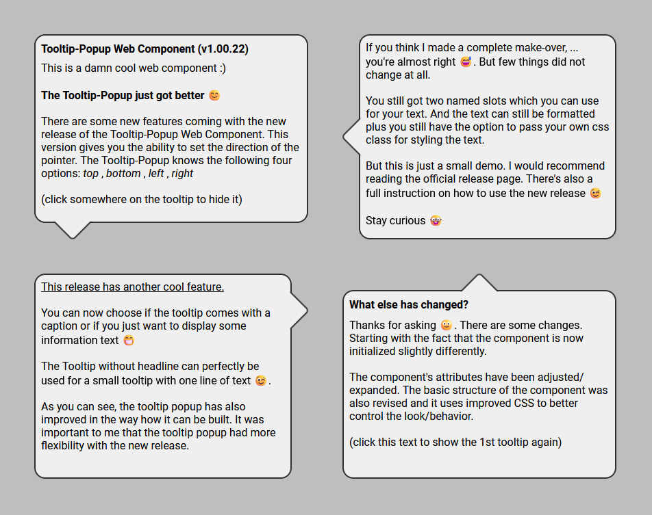

# Tooltip Popup Information

## Preview
<p align="left">

</p>
<br>

## Details
|  |  |
|:-|-:|
|Web Component ID: &nbsp;&nbsp;&nbsp; | &nbsp;&nbsp;&nbsp; Tooltip Popup|
|Current Version: &nbsp;&nbsp;&nbsp; | &nbsp;&nbsp;&nbsp; v1.00.16|
|Current Status: &nbsp;&nbsp;&nbsp; | &nbsp;&nbsp;&nbsp; stable|
|Released Version: &nbsp;&nbsp;&nbsp; |  &nbsp;&nbsp;&nbsp; v1.00.16|

<br>

| Browser Name &nbsp;&nbsp;&nbsp; | &nbsp;&nbsp;&nbsp; Tested Version &nbsp;&nbsp;&nbsp; | &nbsp;&nbsp;&nbsp; Compatibility Check |
|:--|:-:|--:|
| Chrome | 121.0.6167.140 |  |
| Edge | 121.0.2277.98 |  |
| Opera One | 106.0.4998.70 |  |
| Firefox | 122.0 |  |
| Safari | &nbsp; |  |

<br>

## Known Bugs/Issues
<br>

<strong>Release note for Firefox:</strong><br>
Somehow there is a problem with the CSS properties regarding the tooltip pointer. The position of the pointer is displayed incorrectly. And that messes up the layout a bit. You may either see a very thin line between the pointer and the popup text, or the blunt end of the pointer extends too far into the rest of the popup (depending on the height you assign to the tooltip). At the moment I haven't found a solution that works for Chrome/Edge and Firefox. Therefore I cannot recommend using the Badge Widget with Firefox. If you still want to use the component, you do so at your own risk

<br>

## Tooltip Popup Usage Instructions

<strong>Prerequisites:</strong><br>
To use this web component, you have to make sure, that the javascript file <code>tooltip-popup.js</code> and the css file <code>tooltip-popup.css</code> are both in the same directory. Then you have to add the Javascript fie to the header of you html file

```html
<!DOCTYPE html>
<html>
<head>
    <meta charset="UTF-8">
    <meta name="viewport" content="width=device-width, initial-scale=1.0">
    <title>Tooltip Popup</title>
    <!-- ADD THIS LINE TO YOUR HEADER -->
    <script src="tooltip-popup.js"></script>
</head>
<body>

</body>
</html>
```

After adding the Javascript you can use the web component by adding following code to the html file:

```html
<tooltip-popup
    tpid="DemoToolTip"
    size="280x180"
    xaxis="50px"
    yaxis="100px"
    zaxis="500"
    viewmode="visible"
>
    <span slot="tooltipheadtext" class="YOUR-CSS-CLASS">
        <strong>This is the head text</strong>
    </span>
    <span slot="tooltipbodytext" class="YOUR-CSS-CLASS">
        This is the content text
    </span>
</tooltip-popup>
```
<br>

### Explanation/Instruction of the attributes:
<br>
<code>tpid</code>&nbsp;&nbsp;&nbsp;(required)
<br>
This attribute assigns an unique id to the instance of your component. You have to add this to handle the visibiliy of the tooltip. If you want to interact with the instance of your component, you can do this with the following javascript code:<br><br>

```javascript
document.querySelector('tooltip-popup').shadowRoot.getElementById('YOUR-TPID')
```

This line will point on the html element inside the shadow DOM.
<br><br><br>
<code>size</code>&nbsp;&nbsp;&nbsp;(required)
<br>
Here you can set the size of the tooltip. But please note that the value of this attribute must always be in the form NUMBERxNUMBER (<code>200x300</code> or <code>400x240</code>). The first number determines the <code>width</code> and the second number determines the <code>height</code> of the tooltip. It is also important that you do not specify any units here (i.e. no <i>px</i> or <i>vw</i> or <i>vh</i> or anything similar). <b>The minimum height of the tooltip is 80 (!!)</b>
<br><br><br>
<code>xaxis</code>&nbsp;&nbsp;&nbsp;(required)
<br>
This will set the x-position of your tooltip-popup.
<br><br><br>
<code>yaxis</code>&nbsp;&nbsp;&nbsp;(required)
<br>
This will set the y-position of your tooltip-popup.
<br><br><br>
<code>zaxis</code>&nbsp;&nbsp;&nbsp;(required)
<br>
This will set the level on the z-axis of your tooltip-popup.<br>
<b>This value must be lower than 9999!</b>
<br><br><br>
<code>viewmode</code>&nbsp;&nbsp;&nbsp;(required)
<br>
This attribute determines whether your tooltip is visible or hidden. Therefore, this attribute only accepts one of the two values: <code>visible</code> or <code>hidden</code>. If no value or an incorrect value is given here, the component is created with the value <code>hidden</code>
<br><br>

### Explanation/Instruction of the slots:
<br>
The Tooltip Popup has two named slots (<code>tooltipheadtext</code> and <code>tooltipbodytext</code>). To implement those slots into the Tooltip Popup, you have to add <code>&lt;span&gt;</code> tags to the component (look at the code at the top). Both slots have to be added to the component. Otherwise the component can't be built correctly by the javascript and therefore it will not work without these slots.
<br><br>
The <code>tooltipheadtext</code> slot defines the head text of you tooltip. The <code>tooltipbodytext</code> slot defines the content text for the tooltip. You can use your own font styles by simply adding the <code>class='...'</code> attribute to the  <code>&lt;span&gt;</code> tags. The text you want to display on the badge goes between the  <code>&lt;span&gt;</code> tags. 
<br><br><br>

**Please read the following information, if you want to use your own css class:**
<br>
The Javascript (which builds the component) only allows changes to the following css properties:<br>
<i>font-family</i> , <i>font-weight</i> , <i>font-style</i> , <i>font-size</i> , <i>color</i><br>
All other css properties will be ignored.

## Important note about using the component
<code>

YOU ARE USING THESE FILES/SCRIPTS AT YOUR OWN RISK.
YOU DECIDE FOR YOURSELF WHERE AND HOW YOU WANT TO
USE THIS COMPONENT. YOU ARE RESPONSIBLE FOR ANY
CONSEQUENCES THAT MAY RESULT FROM THE USE OF THIS
WEB COMPONENT.

I AM NOT RESPONSIBLE OR LIABLE FOR ANY PROBLEMS,
MALFUNCTIONS, ERRORS OR OTHER DISASTERS THAT MAY
BE CAUSED BY USING THESE FILES IN YOUR PROJECTS.

THESE FILES WERE PUBLICATED UNDER THE MIT LICENSE

</code>